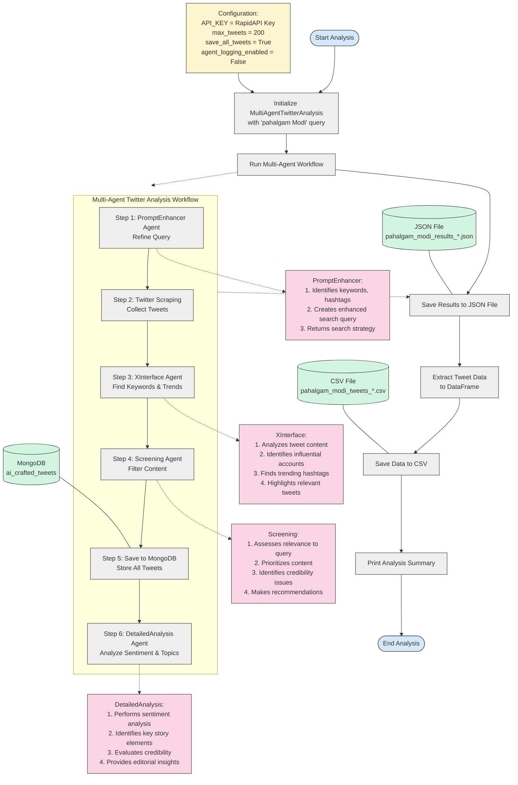

# Pahalgam Modi Twitter Analysis Workflow Diagram

Below is a detailed Mermaid flowchart diagram representing the workflow in `analyze_pahalgam_modi_with_agents.py`. This diagram visualizes how the multi-agent system processes and analyzes Twitter data related to "Pahalgam Modi".

## Workflow Diagram

## How to Use This Diagram

1. Copy the Mermaid code above into a Markdown file or a Mermaid Live Editor
2. View the rendered diagram to understand the workflow
3. Use this as a reference when working with the `analyze_pahalgam_modi_with_agents.py` script

## Key Components Explained

### Main Workflow
- **Start Analysis**: Entry point of the script
- **Initialize MultiAgentTwitterAnalysis**: Creates the workflow object with the "pahalgam Modi" query
- **Run Multi-Agent Workflow**: Executes the 6-step agent workflow
- **Save Results to JSON**: Stores complete analysis results in a JSON file
- **Extract Tweet Data**: Processes tweets into a pandas DataFrame
- **Save Data to CSV**: Exports tweet data to a CSV file
- **Print Analysis Summary**: Outputs a summary of findings to console

### Multi-Agent Workflow
1. **PromptEnhancer Agent**: Refines the user query to identify relevant keywords, hashtags, and accounts
2. **Twitter Scraping**: Uses RapidAPI to collect tweets based on the enhanced query
3. **XInterface Agent**: Analyzes tweets to find trends, influential accounts, and top keywords
4. **Screening Agent**: Evaluates content relevance and credibility, prioritizes important tweets
5. **Save to MongoDB**: Stores all tweets in the MongoDB database
6. **DetailedAnalysis Agent**: Performs sentiment analysis and provides in-depth insights on the content

### Data Stores
- **MongoDB**: Stores the tweet data in the "ai_crafted_tweets" collection
- **JSON Results File**: Contains the complete analysis results
- **CSV File**: Contains the formatted tweet data for easy analysis

### Configuration Parameters
- **API_KEY**: RapidAPI key for Twitter scraping
- **max_tweets**: Maximum number of tweets to collect (set to 200)
- **save_all_tweets**: Flag to save all tweets regardless of screening results (set to True)
- **agent_logging_enabled**: Flag to enable/disable agent logging to MongoDB (set to False to avoid database errors) 